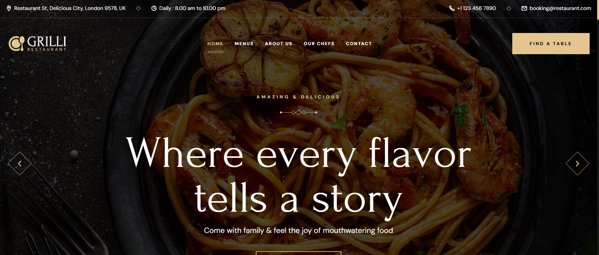
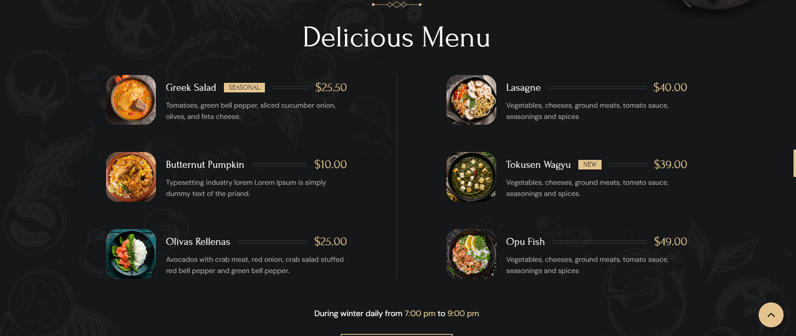
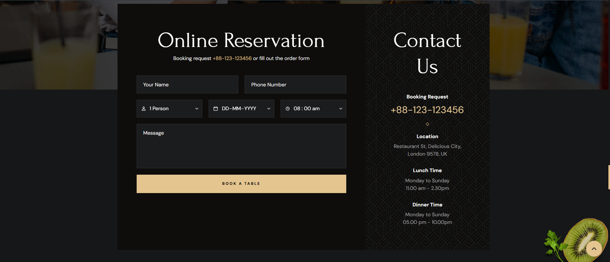

<div align="center">
  <h2 align="center">🍴 Grilli - Restaurant Website</h2>

  Grilli is a fully responsive restaurant website, <br/>
  Responsive for all devices, built using **HTML, CSS, and JavaScript**.

  <br/>
---

## 📸 Demo Screenshots  

### 🖥️ Desktop View  


### 📋 Menu Page  


### 📅 Reservation Page  


---

## 🚀 Features
✔️ Fully responsive design  
✔️ Modern UI/UX  
✔️ Smooth animations  
✔️ Easy customization  

---

## 🛠️ Tech Stack
- **HTML5**
- **CSS3**
- **JavaScript (ES6)**

---

## 📂 How to Use
1. Clone this repository:
   ```bash
   git clone https://github.com/Abhishek11malik/Grilli.git
